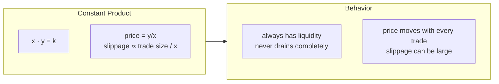

# 01 — Constant Product

> *The simplest thing that could possibly work.*

---

## The invariant

```
x · y = k
```

You put in `x` tokens of one kind and `y` of another. Their product stays fixed. If someone buys some `x`, the pool gains more `x` and loses `y` — so the price of `x` goes up. Supply and demand, automated.

## A trade

Say the pool holds 100 USDC and 1 SOL. `k = 100`.

Someone swaps 10 USDC for SOL:

```
(100 + 10) · (1 − dy) = 100
110 · (1 − dy) = 100
1 − dy = 100/110
dy = 0.0909 SOL
```

They got 0.0909 SOL. The pool now has 110 USDC and 0.9091 SOL. Price moved from 100 USDC/SOL to ~121 USDC/SOL.

## The curve



## What it's good at

- Works for **any** token pair
- Never runs out of liquidity (price → ∞ before reserves hit 0)
- No admin, no parameters — fire and forget

## What it's not good at

If the two assets should trade near 1:1 (like USDC/USDT), constant product is wasteful. A small trade moves the price unnecessarily. The curve is always curved — even when the market says it shouldn't be.

That's where constant sum comes in.

---

[Next → 02 — Constant Sum](02-constant-sum.md)
