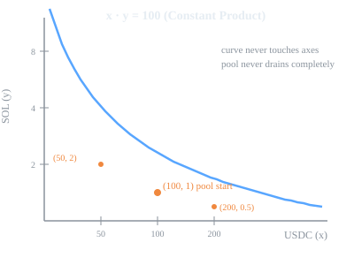

# 01 — Constant Product

> *The simplest thing that could possibly work.*

---

## What is an AMM?

Imagine a vending machine. You put money in, a snack comes out. The price is set by whoever stocked the machine.

An AMM (Automated Market Maker) flips this. There's no human setting prices. Instead, the machine holds a pile of two tokens — say, USDC and SOL. When you trade with it, you add one token and take out the other. The machine uses a formula to decide how much to give you. No order book, no matching, just math.

The money you put in stays in the machine. That money is called **liquidity**, provided by people called LPs (Liquidity Providers). LPs earn a small fee from every trade.

## The formula: constant product

```
x · y = k
```

- `x` = how many token A the pool currently holds (the "reserve" of token A)
- `y` = how many token B the pool currently holds (the "reserve" of token B)
- `k` = a fixed number that never changes during trades

"Product" means multiplication. "Constant" means locked in. **The pool's only rule is: multiply the two reserve amounts together and you always get the same number k.**

## Walking through trades, one by one

Start with a fresh pool: **100 USDC and 1 SOL**. So `k = 100 × 1 = 100`.

Now let's see what happens as people keep buying SOL (swapping in USDC, taking out SOL):

```
Step 0 (starting pool):
    USDC = 100,   SOL = 1.0000
    k = 100 × 1 = 100 ✓
    Price = 100 / 1 = 100 USDC per SOL

Step 1: someone swaps in 10 USDC
    USDC becomes 110
    To keep k = 100:  110 × SOL = 100  →  SOL = 100/110 = 0.9091
    Trader receives: 1.0000 − 0.9091 = 0.0909 SOL
    Price = 110 / 0.9091 ≈ 121 USDC per SOL

Step 2: someone swaps in 100 more USDC
    USDC becomes 210
    To keep k = 100:  210 × SOL = 100  →  SOL = 100/210 = 0.4762
    Trader receives: 0.9091 − 0.4762 = 0.4329 SOL
    Price = 210 / 0.4762 ≈ 441 USDC per SOL

Step 3: someone swaps in 500 more USDC
    USDC becomes 710
    To keep k = 100:  710 × SOL = 100  →  SOL = 100/710 = 0.1408
    Trader receives: 0.4762 − 0.1408 = 0.3354 SOL
    Price = 710 / 0.1408 ≈ 5043 USDC per SOL
```

Look at the price column: 100 → 121 → 441 → 5043. **The more someone buys, the more expensive SOL gets.** Every trade moves the price against the trader.

Now let's look at what happens per-USDC:

| Trade | USDC put in | SOL got out | SOL per USDC |
|---|---|---|---|
| #1 | 10 | 0.0909 | 0.00909 |
| #2 | 100 | 0.4329 | 0.00433 |
| #3 | 500 | 0.3354 | 0.00067 |

Each USDC buys less SOL than the previous one. This is **slippage** — the price gets worse as you trade more. The formula does this automatically. No human adjusts anything.

## What if someone does the reverse?

What if someone sells SOL (swapping SOL in, taking USDC out)?

```
Start from after Step 3: 710 USDC, 0.1408 SOL, k = 100

Someone swaps in 0.05 SOL:
    SOL becomes 0.1908
    To keep k = 100:  USDC × 0.1908 = 100  →  USDC = 100/0.1908 = 524.11
    Trader receives: 710 − 524.11 = 185.89 USDC
    Price = 524.11 / 0.1908 ≈ 2747 USDC per SOL

The price came back down! (5043 → 2747)
```

This shows the pool is **self-correcting**. When SOL gets expensive (too much USDC, not enough SOL), selling SOL brings the price back toward the starting point. The pool always wants to return to where k says it should be.

## Why this shape matters

Plot every possible state of the pool on a graph. The axes are the same as what we've been measuring all along:

- **Horizontal (x-axis):** USDC in the pool — goes from 0 to beyond 200 as people keep buying SOL
- **Vertical (y-axis):** SOL in the pool — starts at 1, shrinks toward 0 as SOL gets bought up

Every point on the curve satisfies `USDC × SOL = 100`. The orange dots in the graph below mark the exact pool states we walked through in the trades above:



The same data in table form — each row is a point on the curve:

| USDC | SOL | k check | What this means |
|---|---|---|---|
| 10 | 10.0000 | 100 ✓ | Almost no USDC, tons of SOL. SOL is dirt cheap (~1 USDC). |
| 50 | 2.0000 | 100 ✓ | Pool is getting more balanced. Price = 25 USDC/SOL. |
| **100** | **1.0000** | **100 ✓** | **Starting pool. Price = 100 USDC/SOL.** |
| 200 | 0.5000 | 100 ✓ | Lots of USDC bought in. SOL is now scarce and expensive (400). |
| 500 | 0.2000 | 100 ✓ | SOL is extremely scarce. Price = 2500 USDC/SOL. |
| 1000 | 0.1000 | 100 ✓ | Almost no SOL left. Price = 10,000 USDC/SOL. |

This is why it's called a "curve" — the points don't form a straight line when plotted. As USDC increases, SOL decreases, but **not at a constant rate**. The drop is steep at first and then flattens out. You can see this in the table:

- Going from 10 USDC → 50 USDC: SOL drops from 10 to 2 (a drop of 8)
- Going from 500 USDC → 1000 USDC: SOL drops from 0.2 to 0.1 (a drop of 0.1)

**The curve is rounded everywhere.** Even near the "balanced" point (100 USDC, 1 SOL), a small trade still moves the price. There's no flat region.

## What this design is good at

- Works for **any two tokens** — you don't need to know anything about their relationship. Pick any two, deposit some amounts, the formula handles the rest.
- **Never drains completely** — the SOL amount approaches 0 but never reaches it (you'd need infinite USDC). The pool keeps functioning.
- **Zero setup** — no parameters to tune, no admin decisions.

## What it's bad at

If two tokens should always trade at 1:1 (like two stablecoins both pegged to $1), constant product is wasteful. Even a small trade pushes the price away from 1:1, and it takes another trade to push it back.

Example: a USDC/USDT pool with 100 USDC and 100 USDT (both $1 coins). k = 10,000.

```
Someone buys 10 USDT with USDC:
    USDC becomes 110
    110 × USDT = 10,000  →  USDT = 90.91
    Trader gets: 100 − 90.91 = 9.09 USDT

They put in 10 USDC but only got 9.09 USDT! That's 9.1% slippage
on a trade that should have been 1:1. The real-world price of USDC
and USDT didn't move — the pool just created artificial slippage.
```

For stable pairs, we need a formula where the price **doesn't move** when the pool is balanced. That's the next design.

---

[Next → 02 — Constant Sum](02-constant-sum.md)
