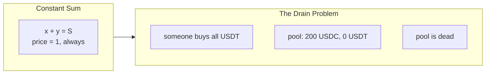
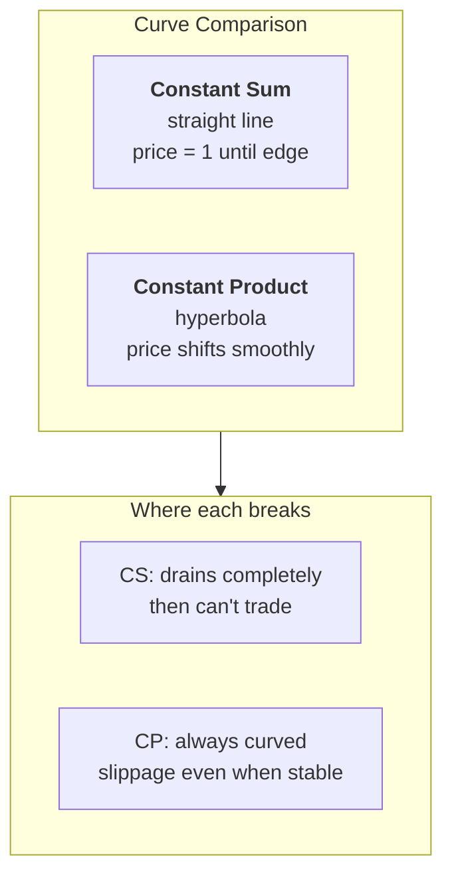

# 02 — Constant Sum

> *What if the price never needs to move?*

---

## The invariant

```
x + y = S
```

The sum of reserves is constant. Trade 10 USDC, get exactly 10 USDT. Every time. Price is always 1:1.

## A trade

Pool holds 100 USDC and 100 USDT. `S = 200`.

Someone swaps 10 USDC for USDT:

```
(100 + 10) + (100 − dy) = 200
110 + (100 − dy) = 200
dy = 10 USDT
```

Price didn't move. Zero slippage. Perfect for stable pairs.

## The problem





## The insight

We want something that acts like constant sum near the peg (low slippage for stable pairs) but curves out like constant product when reserves get imbalanced (so the pool never drains).

We want an **amplification knob** — a parameter that says "at what point does this stop being a straight line and start being a curve?"

That's what Curve Finance built.

---

[← Prev — 01 Constant Product](01-constant-product.md) · [Next → 03 — StableSwap](03-stableswap.md)
