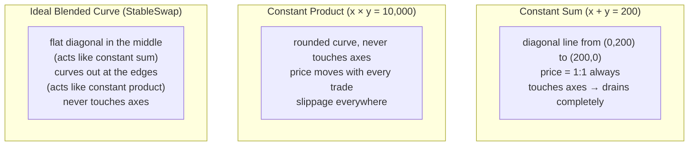

# 02 — Constant Sum

> *What if the price never needs to move?*

---

## The formula

```
x + y = S
```

- `x` = amount of token A in the pool
- `y` = amount of token B in the pool
- `S` = the total sum, fixed at pool creation

"Sum" means addition. Instead of multiplying the reserves, we add them. **The total number of tokens in the pool never changes.**

## Walking through trades

Pool starts with **100 USDC and 100 USDT**. `S = 100 + 100 = 200`. Both are $1 coins, so they should trade at exactly 1:1.

```
Step 0 (starting pool):
    USDC = 100,   USDT = 100
    S = 100 + 100 = 200 ✓
    Price = 1 USDC = 1 USDT (always, by design)

Step 1: someone swaps in 10 USDC, wants USDT
    USDC becomes 110
    To keep S = 200:  110 + USDT = 200  →  USDT = 90
    Trader receives: 100 − 90 = 10 USDT   ← exactly 1:1

Step 2: someone swaps in 50 more USDC
    USDC becomes 160
    To keep S = 200:  160 + USDT = 200  →  USDT = 40
    Trader receives: 90 − 40 = 50 USDT   ← still exactly 1:1

Step 3: someone swaps in 40 more USDC
    USDC becomes 200
    To keep S = 200:  200 + USDT = 200  →  USDT = 0
    Trader receives: 40 − 0 = 40 USDT   ← 1:1 to the last drop
```

Look at the per-USDC rate:

| Trade | USDC in | USDT out | USDT per USDC |
|---|---|---|---|
| #1 | 10 | 10 | 1.0 |
| #2 | 50 | 50 | 1.0 |
| #3 | 40 | 40 | 1.0 |

**Never changes.** No slippage, no matter how big the trade. This is perfect for stablecoins — both are worth $1, so they should exchange 1:1 forever.

## The table of possible pool states

Every valid state must satisfy `USDC + USDT = 200`:

| USDC | USDT | S check | Price (USDC per USDT) |
|---|---|---|---|
| 0 | 200 | 200 ✓ | 1:1 |
| 50 | 150 | 200 ✓ | 1:1 |
| **100** | **100** | **200 ✓** | **1:1 (starting point)** |
| 150 | 50 | 200 ✓ | 1:1 |
| 200 | 0 | 200 ✓ | 1:1 (but pool is dead!) |

Every single row has the same price. The pool is effectively saying "USDC and USDT are identical, trade them freely."

## The fatal flaw

Look at the last row of the table: **(200 USDC, 0 USDT)**. Someone took all the USDT. The sum is still 200, the formula is still satisfied — but the pool has zero USDT left. Nobody can get USDT from it anymore.

The pool went from balanced to drained in three trades:

```
Start:  100 USDC, 100 USDT  →  pool is useful
Step 1: 110 USDC,  90 USDT  →  a bit imbalanced but fine
Step 2: 160 USDC,  40 USDT  →  getting worried
Step 3: 200 USDC,   0 USDT  →  pool is dead, no USDT left
```

This is why constant sum pools don't exist on their own. The straight-line formula offers **no resistance**. It trades at exactly 1:1 until one side hits zero, then it's useless. If one of the pegged coins ever loses its peg in the real world, the mechanical 1:1 exchange drains the pool instantly.

## Comparing the two formulas side by side

Let's put them next to each other with the same starting point — a USDC/USDT pool with 100 of each:

**Constant Product (x × y = 10,000):**

| USDC | USDT | Price |
|---|---|---|
| 50 | 200.00 | 0.25 USDC/USDT (USDT is cheap!) |
| 90 | 111.11 | 0.81 |
| **100** | **100.00** | **1.00 (balanced)** |
| 110 | 90.91 | 1.21 |
| 150 | 66.67 | 2.25 |
| 200 | 50.00 | 4.00 (USDT is expensive) |

The price **moves**. As USDC piles in, USDT gets more expensive. The pool resists imbalance.

**Constant Sum (x + y = 200):**

| USDC | USDT | Price |
|---|---|---|
| 50 | 150 | 1.00 |
| 90 | 110 | 1.00 |
| **100** | **100** | **1.00 (balanced)** |
| 110 | 90 | 1.00 |
| 150 | 50 | 1.00 |
| 200 | 0 | 1.00 (pool dead) |

The price **never moves**. The pool offers infinite liquidity until it runs out.

## What we actually want

We want a formula that **blends** the two behaviors:

- **When the pool is balanced** (USDC ≈ USDT, near the middle): we want constant sum behavior. Zero slippage. 1:1 pricing. Tight spreads. Like the flat diagonal line — the price doesn't budge for normal trading.

- **When the pool gets imbalanced** (one side is much larger, near the edges): we want constant product behavior. The curve bends. Price moves. The pool resists and never fully drains. Like the rounded hyperbola from part 1.

Visually, here are the three curves side by side. Imagine the x-axis is USDC and the y-axis is USDT, both starting at 100 each:



At the center (100 USDC, 100 USDT), all three curves give the same price — 1:1. The difference is what happens when you move away from center:

| Pool state | Constant product price | Constant sum price | Ideal curve price |
|---|---|---|---|
| Balanced (100, 100) | 1.00 | 1.00 | **1.00** (all agree here) |
| Slightly off (110, 91) | 1.21 | 1.00 | **~1.05** (mostly flat, slight bend) |
| Very off (200, 50) | 4.00 | 1.00 (but pool is dead at 200,0) | **~1.50** (curved, resisting, alive) |

The formula should behave like constant sum in the first row, gradually transition in the second, and strongly curve in the third — all controlled by one parameter.

That parameter is the **amplification coefficient A**, the core of Curve Finance's StableSwap. High A = more of the flat diagonal behavior. Low A = more of the curved hyperbola behavior.

That's what we'll build next.

---

[← Prev — 01 Constant Product](01-constant-product.md) · [Next → 03 — StableSwap](03-stableswap.md)
