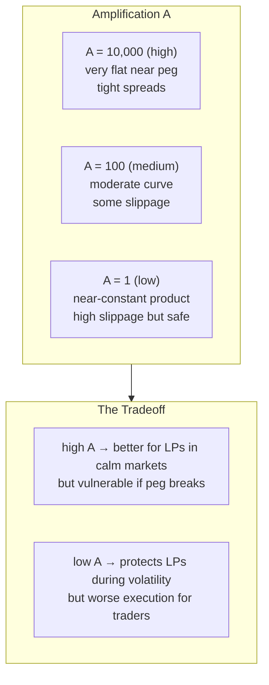

# 03 — StableSwap

> *A dial between constant sum and constant product.*

---

## The idea

Michael Egorov (Curve Finance, 2019) asked: what if we have one parameter that smoothly blends the two invariants?

The answer is the **amplification coefficient A**.

```
A → ∞   →   behaves like constant sum (flat, tight spread)
A → 0   →   behaves like constant product (curved, never drains)
```

## The invariant

For two tokens:

```
4A(x + y) + D = 4AD + D³ / (4xy)
```

`D` is the total deposit size (what the sum would be at equilibrium). `A` is the amplification knob.

The magic: near equilibrium (x ≈ y), the `D³/(4xy)` term is small, and the equation approximates `x + y = D` — constant sum behavior, near-zero slippage. Far from equilibrium, the product term dominates — the curve bends like constant product to prevent drainage.

## What A controls



## Why this matters

StableSwap pools dominate stablecoin trading on Ethereum because they offer the best of both worlds for pegged assets. USDC/USDT pools operate at very high A, giving traders near-zero slippage and LPs healthy volume.

But A is **fixed at pool creation**. If USDC depegs, LPs in a high-A pool get wrecked — the pool drains along the flat part of the curve before anyone can adjust.

**The question: what if A could change?**

---

[← Prev — 02 Constant Sum](02-constant-sum.md) · [Next → 04 — Why Volatility Matters](04-why-volatility-matters.md)
