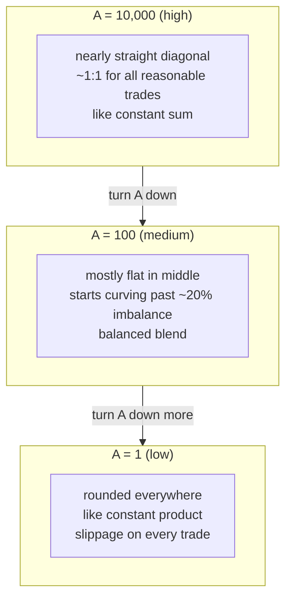

# 03 — StableSwap

> *A dial that blends flat and curved.*

---

## Where we are

We have two formulas:

- **Constant product** (part 1): `x·y = k`. Never drains, but slippage everywhere — even for stable pairs.
- **Constant sum** (part 2): `x + y = S`. Perfect 1:1 pricing, but drains completely if one token runs out.

We want the best of both: **flat in the middle, curved at the edges.**

## The amplification knob: A

Curve Finance introduced a single parameter called the **amplification coefficient**, written as `A`. Think of it as a dial:

```
A = 10,000   →   the curve is almost a straight line (very flat middle)
A = 100      →   moderate bend — some curve, some flatness
A = 1        →   the curve is nearly constant product (rounded everywhere)
```

Higher A means "I'm confident these tokens should trade near the same price." Lower A means "I'm not confident — let the price move freely."

## What A does to a pool, concretely

Let's take a USDC/USDT pool with 100 of each. And a **$1 trade** (swapping 1 USDC for USDT).

| A value | USDT you get for 1 USDC | Slippage | What this means |
|---|---|---|---|
| 10,000 | 0.9999 | ~0% | Near-perfect 1:1. Tight like constant sum. |
| 1,000 | 0.9990 | 0.1% | Tiny slip. Still very tight. |
| 100 | 0.9901 | 1% | Noticeable but small. |
| 10 | 0.9091 | 9% | Significant slippage — the curve is bending. |
| 1 | 0.5025 | 50% | Near constant product. Every trade moves price a lot. |

**The same $1 trade, the same pool, wildly different outcomes** — all controlled by one number.

Now let's see what happens with a **bigger trade of 50 USDC**:

| A value | USDT you get for 50 USDC | Effective price per USDC | Slippage |
|---|---|---|---|
| 10,000 | 49.99 | 1.00 | ~0% |
| 1,000 | 49.50 | 0.99 | 1% |
| 100 | 45.45 | 0.91 | 9% |
| 10 | 33.33 | 0.67 | 33% |
| 1 | 25.00 | 0.50 | 50% |

At A=10,000, you can trade $50 and barely move the price. At A=1, the same trade costs you half the value in slippage. **A controls how much the pool resists imbalance.**

## The actual formula (and why you don't need to solve it)

For two tokens, the StableSwap formula is:

```
4A(x + y) + D = 4AD + D³ / (4xy)
```

- `x` and `y` are the reserves (how much of each token is in the pool)
- `A` is the amplification — the knob we just explored
- `D` is the "total deposit size" — roughly the total value inside the pool when perfectly balanced

**What D does:** when `x` and `y` are equal (balanced pool), `D = x + y`. The pool holds $D worth of value. When the pool gets imbalanced, D stays roughly the same — it represents the economic size.

**How the formula blends the two behaviors:**

- When `x ≈ y` (pool balanced): the `D³/(4xy)` term is small because `4xy ≈ D²`. The formula reduces to roughly `x + y = D` — constant sum, flat, zero slippage.
- When `x >> y` or `y >> x` (pool imbalanced): the `4xy` term shrinks, making `D³/(4xy)` very large. This term dominates, and the formula bends toward `x·y = constant` — constant product, curved, protective.

**How the computer solves it:** the formula is used to calculate trade outputs. You know the current reserves, you know the input amount, and you need to find the output. The computer uses **Newton-Raphson** — a mathematical technique that starts with a guess and repeatedly refines it:

```
Start with a guess for the output
Loop up to 64 times:
    Check if the guess satisfies the formula
    If yes → done
    If no → make a better guess using the slope of the curve
    If 64 iterations pass without converging → error (pool is in an extreme state)
```

This is the same technique calculators use for square roots. You don't need to understand it deeply — just know that it's a proven method that works entirely with integers.

## The tradeoff of A — summarized

| A value | Pool behavior | Best for | Danger |
|---|---|---|---|
| High (1,000–10,000+) | Very flat around the peg | Stable pairs you're confident about | If the peg breaks, the flat curve drains LP capital fast |
| Medium (100–1,000) | Moderate curve, some give | Correlated assets | Neither tight enough nor protective enough |
| Low (1–10) | Rounded, high slippage | Volatile pairs, LP safety | Traders pay a lot, may go elsewhere |

How the curve shape changes with A — same pool (100 USDC, 100 USDT), same starting point, different A values:



## The problem nobody solved until now

In every existing StableSwap pool — Curve on Ethereum, Saber on Solana — **A is picked once when the pool is created and never changes.**

If you launched a USDC/USDT pool with A=2000 and USDC depegs to $0.90, the flat curve acts like a drain — it keeps trading 1:1 mechanically while the real world says 1:0.90. LPs get wrecked.

If you chose A=10 for safety and the pair stays perfectly stable for two years, you're charging traders 10% slippage for no reason. They go to a competitor.

**The pool is always wrong for the market it's actually in.** A needs to change as conditions change. That's what V-AMM does. But first: what signal tells A to move?

---

[← Prev — 02 Constant Sum](02-constant-sum.md) · [Next → 04 — Why Volatility Matters](04-why-volatility-matters.md)
