# 04 — Why Volatility Matters

> *Markets don't sit still. Your AMM shouldn't either.*

---

## What is volatility?

Volatility means how much and how fast a price moves up and down.

- **Low volatility:** USDC/USDT most days. Price stays glued near $1. Daily moves of 0.01%.
- **High volatility:** A meme coin during a pump. Price can swing 50% in an hour, retrace 30%, then crash 80%.

Volatility isn't good or bad — it describes the "jumpiness." But for an AMM, it's everything. LP losses grow with volatility. If your pool doesn't know how volatile the market is, it can't protect the people providing liquidity.

## What LPs lose: Impermanent Loss (IL)

You deposit $100 of token A and $100 of token B into a pool — $200 total. The price of A doubles relative to B. You withdraw. How much do you have?

| Scenario | Value after price change | Loss vs holding |
|---|---|---|
| You just held both tokens | A worth $200, B worth $100 = **$300** | — |
| You provided liquidity (A=10, curved) | Depends on the curve. Roughly **$283** | Lost $17 (5.7%) |
| You provided liquidity (A=2000, flat) | Aggressive rebalancing. Roughly **$245** | Lost $55 (18.3%) |

Why? Because the pool automatically rebalances. When A rises vs B, the pool sells A and buys B to maintain the formula. You end up holding more of the asset that went down and less of the one that went up. The trader who caused the price move gets the asset they wanted; the LP absorbs the imbalance.

The loss is called "impermanent" because it only locks in when you withdraw. If the price returns to where you entered, the loss vanishes. But if it doesn't return — like a depeg — the loss is permanent.

**IL gets worse the higher A is.** A flat-curve pool aggressively rebalances, rapidly converting your position to the losing asset. A curved pool rebalances more gently.

## What LPs lose: Loss-Versus-Rebalancing (LVR)

This is newer but arguably more important. Here's the scenario:

```
1. SOL is $100 on Binance. The AMM's internal price is also $100 (last trade).
2. SOL jumps to $105 on Binance (news, whale trade, etc.).
3. An arbitrageur sees this. On the AMM, SOL is still priced at $100.
   They buy SOL from the AMM at $100 and instantly sell on Binance at $105.
4. The AMM just sold SOL $5 below market value.
5. The LP who provided that SOL lost $5 per SOL sold to the arbitrageur.
```

This happens **every time the external price moves.** The AMM is always slightly behind the market, and arbitrageurs extract that difference. LVR is the total value lost to these arbitrage trades.

**LVR gets worse with high volatility and low fees:**

| Volatility | Fee | What happens |
|---|---|---|
| Low (5%) | 5 bps | Few arb opportunities. Fee covers the occasional LVR. LP is fine. |
| Low (5%) | 30 bps | Overpriced for the risk. Traders avoid the pool. Volume dies. |
| High (50%) | 5 bps | Lots of arb opportunities. Fee is too low to cover LVR. LP bleeds. |
| High (50%) | 30 bps | Fee roughly covers LVR. LP breaks even or earns a little. |
| Extreme (200%) | 5 bps | LP is destroyed by arbs. Pool drains rapidly. |
| Extreme (200%) | 100 bps | Fee mostly covers LVR. Pool survives the storm. |

The takeaway: **the right fee depends on the volatility.** You can't pick one number at launch and expect it to work for all market conditions.

## The core problem with all existing AMMs

Every major AMM picks its settings at launch and locks them forever:

| AMM | What's frozen | The problem |
|---|---|---|
| Uniswap V2 | 0.30% fee, constant product | Fixed fee. Too high for stable pairs (wasted spread), too low during crashes (LP gets wrecked). |
| Uniswap V3 | LP picks fee tier + price range at deposit | LP guesses future volatility. Wrong guess = capital sits useless or gets arbed. |
| Curve | Fixed A at pool creation | A is right for exactly one market regime. Depeg? A is wrong. Months of calm? A is wrong. |
| Orca | LP picks fee tier + price range | Same guesswork as Uniswap V3. |

**None of them adapt.** The pool launched on a calm Tuesday has the wrong settings when the market panics on Friday. The pool launched during a crash has the wrong settings when everything stabilizes.

## What the pool actually needs

The market has two basic states. The pool should behave differently in each:

| | Calm Market | Volatile Market |
|---|---|---|
| **What's happening** | Price stable, near peg | Price jumping, uncertainty high |
| **LP risk** | Low | High (IL + LVR) |
| **Traders want** | Tight spreads (low cost) | Execution certainty |
| **Pool should do with A** | High A — flat curve, tight price | Low A — curved, protective |
| **Pool should do with fee** | Low fee (5 bps) — attract volume | High fee (30–100 bps) — compensate LP risk |

```mermaid
flowchart LR
    subgraph CALM["Calm Market (σ ≤ 15%)"]
        C1["low volatility"]
        C2["LP risk: low"]
        C3["want: HIGH A, LOW fee"]
    end

    subgraph TRANSITION["Transition"]
        T1["σ rises"]
        T2["A ramps down over 1 hr"]
        T3["fee slides up 10 bps/slot"]
    end

    subgraph VOLATILE["Volatile Market (σ ≥ 75%)"]
        V1["high volatility"]
        V2["LP risk: high (IL + LVR)"]
        V3["want: LOW A, HIGH fee"]
    end

    CALM -->|"volatility spike"| TRANSITION -->|"sustained chaos"| VOLATILE
    VOLATILE -.->|"market recovers"| TRANSITION -.->|"returns to calm"| CALM
```



The signal that tells us which regime we're in is **volatility**. If we can measure it continuously:

- **Volatility rises** → lower A (curve steepens, protects LPs), raise fees (compensate for risk)
- **Volatility falls** → raise A (curve flattens, tight spreads), lower fees (attract volume)

## The challenge

We need to measure volatility **on-chain, in real time, using only the pool's own trade history.** No external oracles. No off-chain data. No floating-point math — Solana's runtime doesn't allow decimals, logs, or square roots.

Every operation must be integer arithmetic: addition, multiplication, division. That's it.

---

[← Prev — 03 StableSwap](03-stableswap.md) · [Next → 05 — On-Chain Volatility](05-on-chain-volatility.md)
