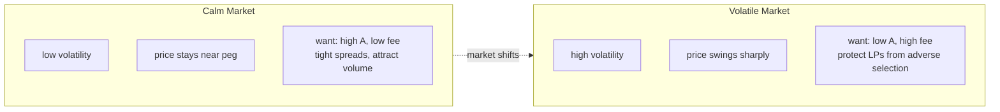
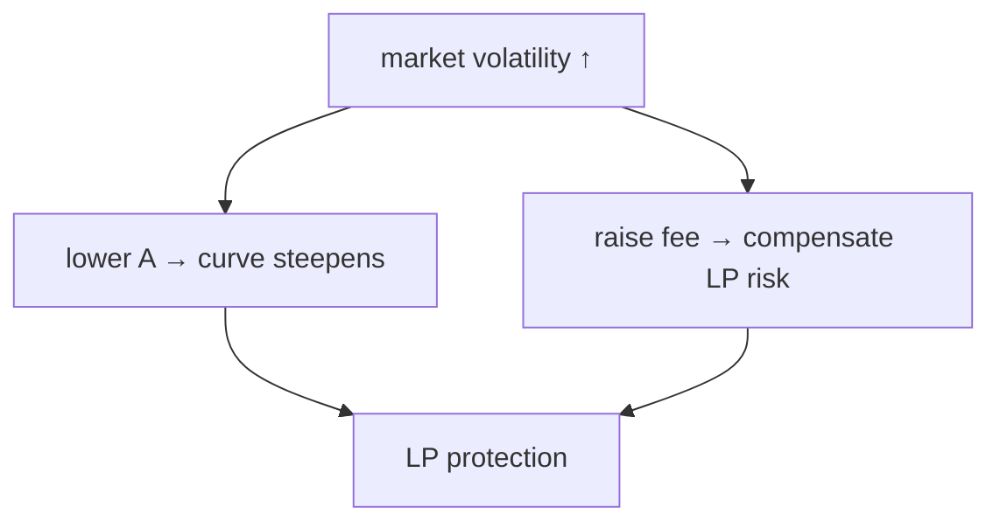

# 04 — Why Volatility Matters

> *Markets don't sit still. Your AMM shouldn't either.*

---

## The core problem

All major AMMs pick their curve at launch and never change it:

| AMM | Curve decision | When |
|---|---|---|
| Uniswap V2 | Fixed 0.30% fee | Forever |
| Uniswap V3 | LP chooses fee tier + range | At position creation |
| Curve | Fixed A | At pool creation |
| Orca Whirlpools | LP chooses fee tier + range | At position creation |

**None of them respond to changes in market conditions.**

## Two regimes, one pool

A pool with fixed parameters is always wrong for one of these regimes. If it's tuned for calm, LPs bleed during volatility. If it's tuned for volatile, traders pay unnecessary spread when things are quiet.

## What LPs actually lose

Two forces eat LP returns:

- **Impermanent loss (IL)** — the difference between holding tokens vs. providing liquidity when prices move. Worse when price moves further from entry.
- **Loss-versus-rebalancing (LVR)** — arbitrageurs extract value from stale AMM prices faster than LPs can rebalance. Worse when volatility is high and fees are low.

Both scale with volatility. A static curve can't respond.

## The answer

If we can **measure** volatility and **adjust** the curve in response, the pool stays calibrated. Calm = flat + cheap. Volatile = curved + expensive.

The next question: how do you measure volatility on-chain?

---

[← Prev — 03 StableSwap](03-stableswap.md) · [Next → 05 — On-Chain Volatility](05-on-chain-volatility.md)
