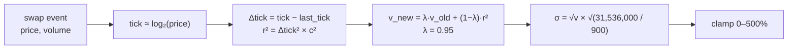
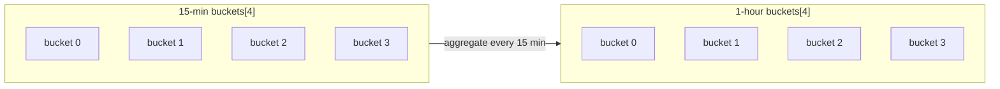

# 05 — On-Chain Volatility

> *No oracles. No off-chain data. Just math from trade history.*

---

## The constraint

Solana's BPF runtime has no floating point. No `ln()`, no `exp()`, no `sqrt()` on `f64`. Everything must be integer math.

We need to compute realized volatility from swap prices using only addition, multiplication, and division.

## The tick trick

Uniswap-style ticks are already logarithmic:

```
tick = log₁.₀₀₀₁(price)
```

A tick difference is a log return — no `ln()` needed:

```
r = ln(P₂/P₁) = (tick₂ − tick₁) × ln(1.0001)
```

For variance we only need `r²`, so we square the tick difference and absorb the constant into scaling.

On Solana we approximate the tick from price using `leading_zeros` (an approximate log₂):

```
log₂(price) ≈ 128 − price.leading_zeros()
tick ≈ log₂ × 6931 / 10000
```

## The EWMA

We maintain an exponentially weighted moving average of squared returns:

```
v_new = 0.95 × v_old + 0.05 × r²
```

Every swap updates this. Recent volatility weighs more. Old data decays.



## Time bucketing

We also maintain ring buffers of 15-minute and 1-hour price buckets:



Each bucket stores cumulative tick × time, volume, and timestamps. These provide sanity checks against the EWMA — if a single bucket spikes unnaturally, we can detect manipulation.

## Annualization

```
σ_annual = σ_bucket × √(seconds_per_year / bucket_seconds)
         = √v × √(31,536,000 / 900)
```

The EWMA tracks a 15-minute window. We scale up to annual terms for a standardized volatility reading.

## Why this works

- **No oracle** — everything comes from the pool's own trade history
- **No float** — every operation is u128 integer math
- **Manipulation-resistant** — EWMA smooths single-trade spikes; bucketing provides cross-verification
- **Cheap** — a few hundred compute units per swap update

Now we have a number: **σ**, annualized realized volatility. What do we do with it?

---

[← Prev — 04 Why Volatility Matters](04-why-volatility-matters.md) · [Next → 06 — Dynamic Fees](06-dynamic-fees.md)
