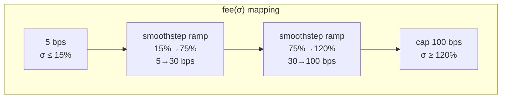
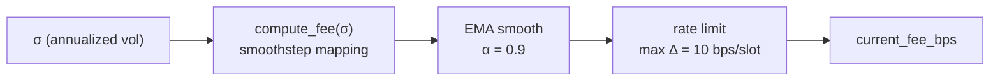

# 06 — Dynamic Fees

> *When the market gets wild, LPs need a bigger cut.*

---

## The fee spectrum

Academic research (Campbell et al., Baggiani et al.) converges on a simple idea: fees should be low enough to attract volume but high enough to offset adverse selection.

| Volatility | What's happening | Fee should be |
|---|---|---|
| σ ≤ 15% | Stable, pegged assets | Very low (5 bps) |
| 15% < σ < 75% | Normal volatility | Ramp up smoothly |
| 75% ≤ σ < 120% | High volatility | Significant (30–100 bps) |
| σ ≥ 120% | Chaos | Cap at 100 bps |

## Smoothstep

We don't want the fee to jump at threshold boundaries — that creates arbitrage opportunities. Instead we use a smoothstep function:

```
smoothstep(t) = 3t² − 2t³
```

It creates S-curves with zero derivative at endpoints:



## EMA smoothing

Raw volatility can spike on a single large trade. We don't want fees to whipsaw, so we run the raw fee through an EMA:

```
fee_ema = 0.9 × old_ema + 0.1 × fee_raw
```

This gives a ~10-update half-life — fees respond to persistent volatility shifts, not single trades.

## Rate limiting

Even EMA-smoothed, a fee could jump 50 bps in one block. That's still an attack surface. So we cap:

```
|fee_new − fee_old| ≤ 10 bps per slot
```

Max 10 basis points of fee change per block. A full regime shift from 5 to 100 bps takes ~10 blocks (~4 seconds on Solana) — fast enough to respond, slow enough to prevent manipulation.

## The full fee pipeline



Now we have two things that respond to volatility: **A** and **fee**. How do they work together?

---

[← Prev — 05 On-Chain Volatility](05-on-chain-volatility.md) · [Next → 07 — Moving Parts Together](07-moving-parts-together.md)
