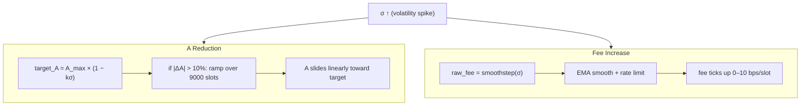
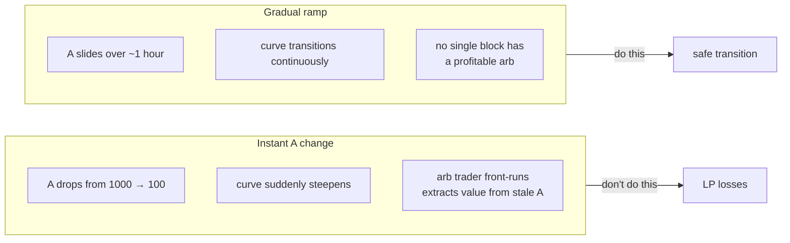
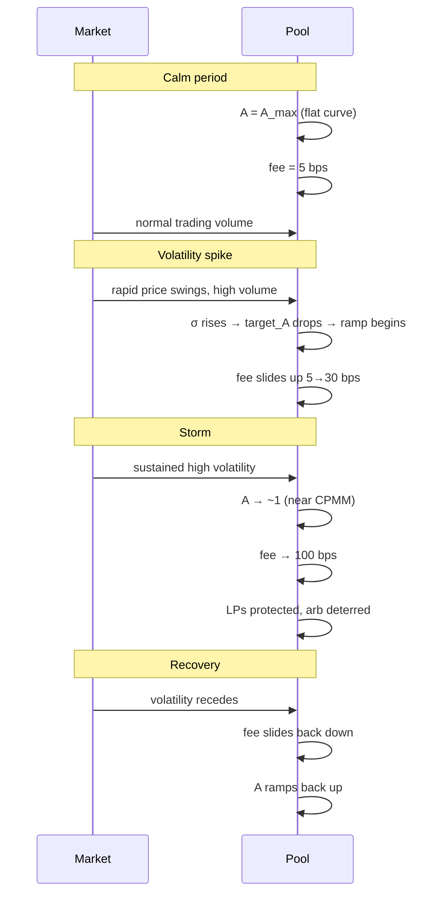

# 07 — Moving Parts Together

> *A ramps down, fees ramp up. Never at the same time. Always smoothly.*

---

## The two knobs

When volatility rises, two things happen in parallel:



## The ramp

A doesn't jump — it **ramps**. If the target shifts from 1000 to 100, we set:

```
a_start = a_current
a_target = target_A
ramp_end = now + 9000
```

Every instruction reads the current slot and interpolates:

```
progress = (slot − start) / (end − start)
a_current = a_start + (a_target − a_start) × progress
```

## Why gradual is critical



## The fee cooldown

Same philosophy for fees. Even our smoothstep + EMA combo could still be gamed with carefully timed trades. The 10 bps/slot cap means:

- A trader can't spike the fee to block competitors
- A wash trader can't manufacture high fees for LP extraction
- The fee "earns" its way up — it takes sustained volatility, not a single event

## What the pool experiences



The pool breathes with the market. No governance votes. No keeper keys. No admin.

---

[← Prev — 06 Dynamic Fees](06-dynamic-fees.md) · [Next → 08 — On Solana](08-solana-program.md)
