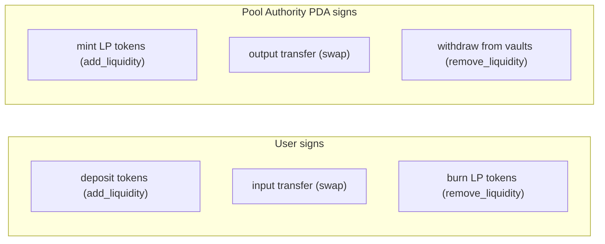

# 08 — On Solana

> *How the math becomes a program.*

---

## The program

V-AMM is a single Anchor program deployed to Solana devnet:

```
Program ID: 75yCYNeZrSoVKWk5kFti7tRpRacZHptmAqtPwfc9U4Zt
```

One program, six instructions. No cross-program calls between modules — everything lives in one crate.

## Instructions

```
initialize_pool    → create pool + volatility PDAs, LP mint, token vaults
swap               → StableSwap trade, dynamic fee, write volatility breadcrumb
add_liquidity      → deposit pair, mint LP shares (D-based)
remove_liquidity   → burn LP, withdraw proportional reserves
update_volatility  → read EWMA, recompute A target + fee (permissionless)
update_curve       → interpolate A ramp (permissionless)
```

Two instructions are permissionless — anyone can call `update_volatility` or `update_curve`. No admin key, no keeper allowlist. The pool maintains itself.

## PDAs

Seeds for every program-derived address:

```
PoolState        ["pool", mint_a, mint_b, pool_id_le]
VolatilityState  ["volatility", pool_state]
PoolAuthority    ["authority", pool_state]
LpMint           ["lp_mint", pool_state]
VaultA           ["vault_a", pool_state]
VaultB           ["vault_b", pool_state]
Position         ["position", pool_state, user, &[0u8]]
```

All vault PDAs trace back to `pool_state`. The pool authority PDA owns the token vaults and LP mint — no admin key needed for token transfers. The program signs via CPI with PDA seeds.

## Who signs what



## Account flow: a swap

```
User calls swap(amount_in, min_out, direction)
  │
  ├→ Validate: pool accounts, token mints, amount > 0
  ├→ Read: PoolState (reserves, curve_a_current, fee_bps)
  ├→ Read: VolatilityState (EWMA variance, last_tick)
  ├→ Read: Clock sysvar (slot)
  │
  ├→ Sync curve A for current slot (interpolate ramp)
  ├→ Calculate fee = amount_in * current_fee_bps / 10000
  ├→ StableSwap::get_dy(reserves, i, j, net_in, A)
  ├→ Check: dy >= min_amount_out
  │
  ├→ CPI: Token::Transfer(user → input_vault)    signed by user
  ├→ CPI: Token::Transfer(output_vault → user)   signed by PDA
  │
  ├→ Update PoolState: reserves, fee_growth, last_swap_slot
  ├→ Update VolatilityState: tick, bucket, EWMA
  │
  └→ Done
```

## Where to find it

```
vamm/
├── Anchor.toml
├── programs/vamm/
│   ├── Cargo.toml
│   └── src/
│       ├── lib.rs                   program entry, instruction dispatch
│       ├── state.rs                 PoolState, VolatilityState, PositionState
│       ├── math/mod.rs              StableSwap + VolatilityMath
│       ├── error.rs                 11 error variants
│       ├── constants.rs
│       └── instructions/
│           ├── mod.rs
│           ├── initialize_pool.rs
│           ├── swap.rs
│           ├── add_liquidity.rs
│           ├── remove_liquidity.rs
│           ├── update_volatility.rs
│           └── update_curve.rs
```

## Further reading

- [`ARCHITECTURE.md`](../ARCHITECTURE.md) — full architecture diagrams, CPI matrix, error paths
- [`reports/`](../reports/) — deep dives on StableSwap math, volatility engine, dynamic fees, adversarial analysis
- [`README.md`](../README.md) — project overview, install instructions

---

[← Prev — 07 Moving Parts Together](07-moving-parts-together.md)
