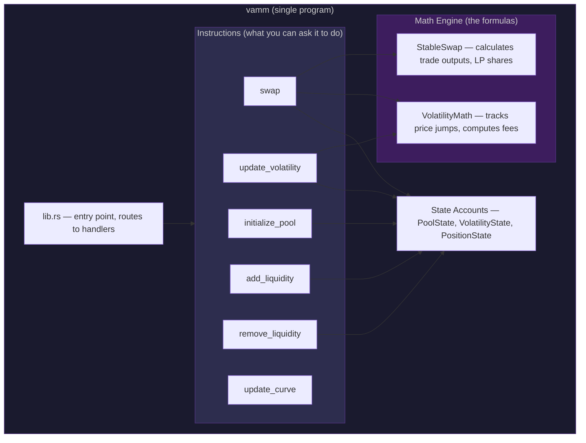
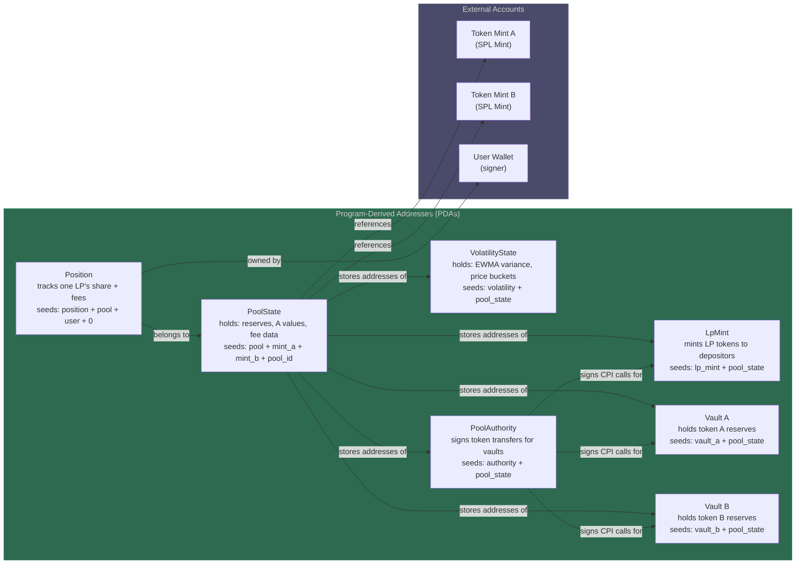
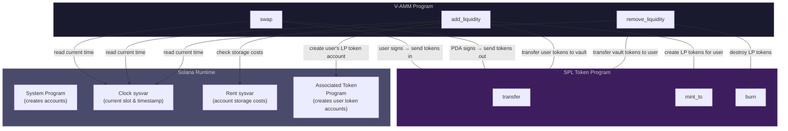
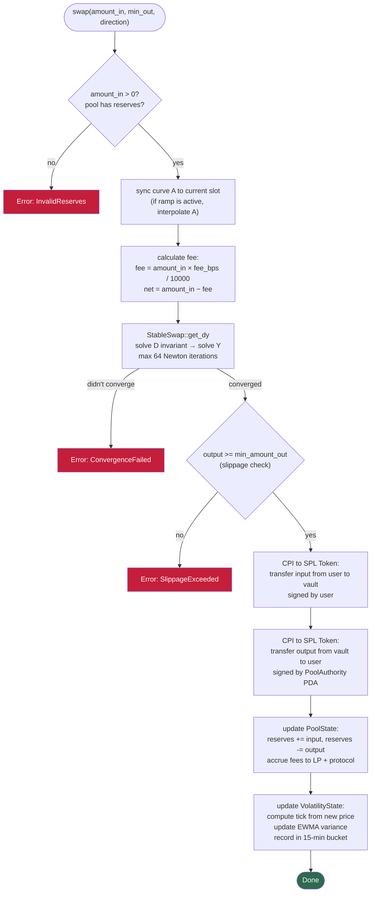
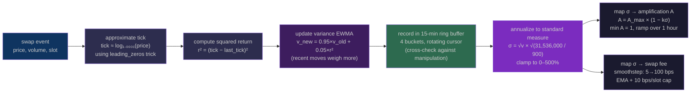

# V-AMM Architecture

> Solana Protocol Architecture — Capstone Assignment

---

The V-AMM (Volatility-Adaptive Automated Market Maker) is a single Solana program that lets you trade tokens, provide liquidity, and earn fees. What makes it different: the pool watches its own price history and automatically adjusts its curve shape and fees based on how volatile the market is. No oracles, no admin, no human in the loop.

This document maps every piece: the program structure, the on-chain accounts, how they connect, what happens during each operation, and where things can go wrong.

---

## 1. Program Structure

The entire V-AMM is one program — one deploy, one crate, one codebase. It has six operations (called "instructions") and two math engines that do the heavy lifting.



**How instructions connect to math:**

- `swap` uses StableSwap to calculate how many tokens the trader gets, and uses VolatilityMath to record the new price in the volatility tracker
- `add_liquidity` and `remove_liquidity` use StableSwap's D-invariant to calculate fair LP shares
- `update_volatility` uses VolatilityMath to recalculate the target curve shape and fee from the EWMA (explained in section 5)
- `update_curve` reads the current slot and interpolates A between start and target (explained in section 7)

---

## 2. Account Map & PDA Tree

Solana stores all data in "accounts." Each account has an address and holds some bytes. A **PDA** (Program Derived Address) is a special account whose address is computed from a formula (called "seeds") instead of being a random keypair. This has two big benefits:

1. **You can always find a PDA** given its seeds — no need to store its address somewhere else
2. **Only the program that created it can sign for it** — there's no private key to steal

V-AMM uses seven PDA types, all derived from the pool state or the pool state + user:



**The authority model in plain English:**

The pool's vault accounts hold real tokens (USDC, SOL, etc.). Someone needs to "sign" when those tokens move out of the vault — for example, when a trader receives their swap output. Instead of giving a human admin key that power (which could drain the pool), V-AMM uses a PDA called PoolAuthority. The program itself controls this PDA. Token transfers out of vaults are signed by `["authority", pool_state_address]` — a signature only the program can produce, following its own rules.

---

## 3. External Dependencies

V-AMM doesn't do everything itself. For token transfers, it calls the standard SPL Token Program — the same program every token on Solana uses. This is called CPI (Cross-Program Invocation): one program calls another.



**Two signing modes:**

- **User signs:** when tokens move FROM the user (deposits, swap input payments). The user authorizes these with their wallet.
- **Pool Authority PDA signs:** when tokens move OUT of the vaults (withdrawals, swap outputs, LP minting). Only the program can produce this signature, and only when the instruction's logic allows it.

---

## 4. Swap Flow (the core operation)

This is the main action — someone trades token A for token B. Here's everything that happens, in order:



**The fee split:** 90% of the fee goes to liquidity providers (added to `fee_growth_global`). 10% goes to the protocol (`protocol_fees`). LPs earn their share of fees automatically — their position tracks a snapshot of the global fee growth and calculates the difference at withdrawal time.

## 5. Volatility Pipeline (how the pool watches the market)

Every swap writes a price breadcrumb. The volatility engine digests these breadcrumbs into a single number: **σ**, the annualized realized volatility. Then σ drives two outputs — the curve shape (A) and the swap fee.



**Key design choices in the pipeline:**

- **No floating point** — Solana's runtime doesn't allow decimals. Everything is integer math (u128). The tick approximation uses `leading_zeros()` (count leading zero bits) to get a cheap log₂, then multiplies by a constant to convert to log₁.₀₀₀₁.
- **EWMA (Exponential Weighted Moving Average)** — a running average that weights recent data more. λ = 0.95 means each update keeps 95% of the old value and adds 5% of the new. A single spike barely moves the needle; sustained volatility pushes it steadily.
- **Two time windows** — 15-minute buckets feed the EWMA (fast response). 1-hour buckets aggregate from 15-min buckets (slow, manipulation-resistant). If the EWMA says 500% but the 1-hour bucket only saw 3 trades, something is wrong.
- **Clamping** — volatility is capped at 500%. This prevents arithmetic overflow and keeps downstream fees/A calculations in a safe range.

## 6. Adding and Removing Liquidity

```mermaid
flowchart TD
    subgraph ADD["add_liquidity"]
        A1(["start"]) --> A2[transfer token A from user to Vault A]
        A2 --> A3[transfer token B from user to Vault B]
        A3 --> A4{"first LP ever?<br/>(total_lp_shares == 0)"}
        A4 -->|yes| A5["shares = D(deposits)<br/>(D = StableSwap invariant)"]
        A4 -->|no| A6["shares = ΔD/D_old × total_lp<br/>(proportional to D growth)"]
        A5 --> A7[mint LP tokens to user<br/>CPI: Token::MintTo<br/>signed by PoolAuthority PDA]
        A6 --> A7
        A7 --> A8[update PoolState: reserves, total_lp<br/>create or add to PositionState]
        A8 --> A9([done])
    end

    subgraph REMOVE["remove_liquidity"]
        R1(["start"]) --> R2["calculate withdrawal:<br/>amount = shares/total_lp × reserves"]
        R2 --> R3[burn LP tokens from user<br/>CPI: Token::Burn]
        R3 --> R4[transfer token A from Vault A to user<br/>CPI signed by PoolAuthority PDA]
        R4 --> R5[transfer token B from Vault B to user<br/>CPI signed by PoolAuthority PDA]
        R5 --> R6[reduce reserves, total_lp, position shares]
        R6 --> R7([done])
    end

    style ADD fill:#2d6a4f,color:#ccc
    style REMOVE fill:#2d6a4f,color:#ccc
```



**Why D-invariant instead of simple proportional math:**

In a constant-product pool, if you deposit 10% of the reserves you get 10% of the LP shares — simple. But StableSwap isn't constant product. The D-invariant represents the "economic size" of the pool in a way that respects the curve shape. Depositing `amount_a` and `amount_b` increases D by some amount, and your LP shares are proportional to that D increase. This ensures fair treatment even when the pool is imbalanced or A is changing.

## 7. Permissionless Cranks (how the pool maintains itself)

Two instructions can be called by **anyone** — no admin key, no keeper allowlist:

**`update_volatility`:**
1. Reads the current EWMA variance from VolatilityState
2. Annualizes it → σ
3. Computes target A from σ: `target_A = A_max × (1 − kσ)`, clamped to minimum 1
4. Computes raw fee from σ: smoothstep mapping, 5–100 bps
5. EMA-smooths and rate-limits the fee
6. If target A differs from current target by >10%, sets a new ramp (9000 slots)
7. Updates `current_fee_bps` and `curve_a_target`

**`update_curve`:**
1. Reads the current slot from the Clock sysvar
2. If the A ramp is active, interpolates A between `a_start` and `a_target`
3. Linear interpolation: `a_current = a_start + (a_target − a_start) × elapsed/duration`
4. Updates `curve_a_current`

These are designed to be called by keeper bots — automated scripts that send these instructions once per block. The bots pay a small transaction fee; the pool stays calibrated. Anyone can run a keeper. No one can abuse the position because the instructions only do what the math allows.

**Why ramping over 1 hour:** If A jumped instantly from 1000 to 100, an arbitrageur could sandwich the change — buy at the old tight price, wait for the curve to steepen, sell at a profit. A 9000-slot ramp (~1 hour) means A changes 0.01% per slot. No profitable arb window.

**Why rate-limiting fees:** Even with smoothing, a sudden volatility spike could push fees from 5 to 100 bps in a few slots. A 10 bps/slot cap means it takes ~10 slots (~4 seconds) to go from min to max. Fast enough to respond to real volatility, slow enough that a manipulator can't spike it in one block.

## 8. Error Handling

Every instruction validates inputs before doing anything. If validation fails, the entire transaction reverts — no partial state changes, no stuck tokens. Here are all the error cases:

```
MathOverflow          → a numeric calculation exceeded u128 range.
                        Every multiplication uses checked_mul/div.

InvalidReserves       → pool reserves are zero, or input amount is zero.
                        Checked at the start of swap/add/remove.

SlippageExceeded      → the trade output is below what the user specified
                        as min_amount_out. Protects against front-running.

ConvergenceFailed     → the Newton-Raphson solver hit 64 iterations
                        without finding a solution. Shouldn't happen with
                        valid inputs; indicates extreme pool imbalance.

InvalidTokenAccount   → the user's token account doesn't match the pool's
                        mint. Prevents sending wrong tokens.

Unauthorized          → someone tried to withdraw from a position they
                        don't own (owner check on PositionState).

PoolPaused            → the pool status flag is set (emergency pause).

VolatilityPaused      → the volatility state flag is set.

ZeroAmount            → zero passed where a positive amount is required.

InvalidAmplification  → A parameter out of valid range.

InvalidFee            → fee parameter out of valid range.
```

All errors bubble up through Rust's `Result<()>` type and are returned to the caller. No panics, no unwraps, no assertions.

## 9. Key Design Decisions

1. **Single program** — no cross-program calls between V-AMM modules. One deploy, one audit surface, one upgrade path.

2. **PDA-based pool authority** — no admin key exists that could drain the vaults. Token transfers out are signed by a PDA only the program controls, and only when instruction logic permits.

3. **On-chain realized volatility** — no external oracle dependency. The pool watches its own trade history. Works for any token pair, no Chainlink/Pyth required.

4. **Gradual A ramp** — A slides over 9000 slots (~1 hour) to prevent curve-transition arbitrage. No single block has a profitable price discrepancy.

5. **Rate-limited fee changes** — max 10 bps per slot. Prevents fee manipulation attacks. Fee changes "earn" their way through sustained volatility.

6. **All integer math (u128)** — no floating point anywhere. SBPF-compatible. Fixed-point scale of 1e12 for precision.

7. **Permissionless cranks** — anyone can call `update_volatility` and `update_curve`. No keeper key, no DAO vote. The pool is self-maintaining.

8. **Pool ID** — `pool_id: u16` allows multiple pools for the same token pair with different A_max, k, and fee parameters.

9. **Separate volatility account** — VolatilityState is its own PDA, not embedded in PoolState. This lets the volatility data grow independently (the 4×4 bucket arrays take ~250 bytes) without bloating the pool account used in every instruction.

10. **Standard SPL Token** — all token operations use the standard SPL Token and Associated Token programs. V-AMM LP tokens are regular SPL tokens. Full composability with the Solana DeFi ecosystem.
