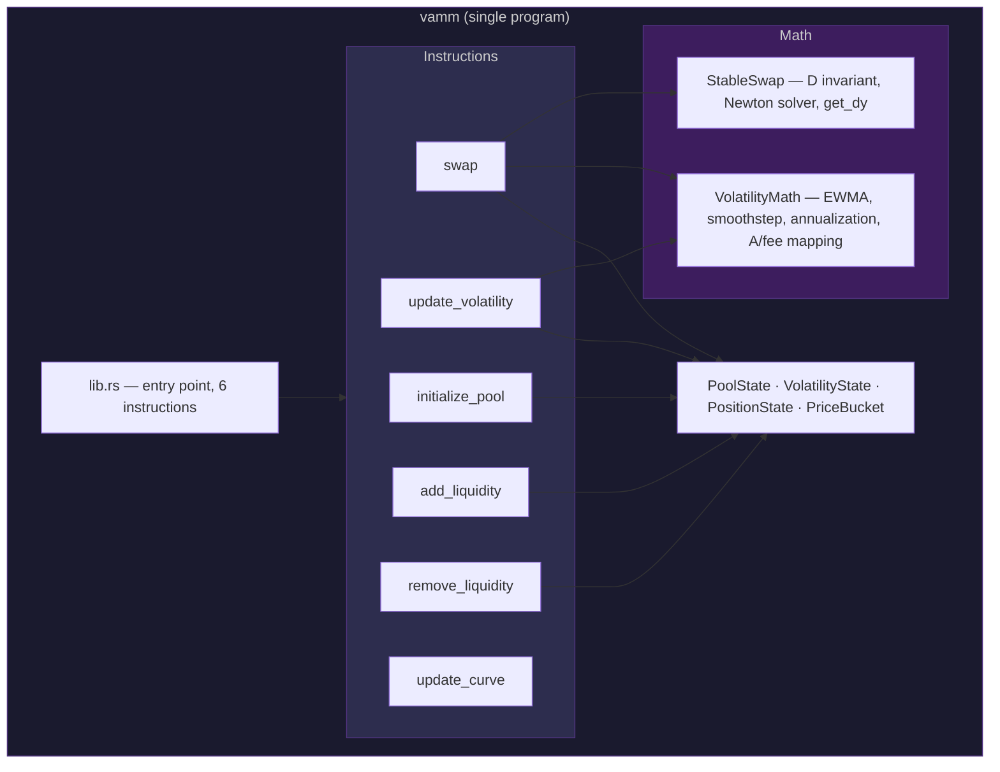
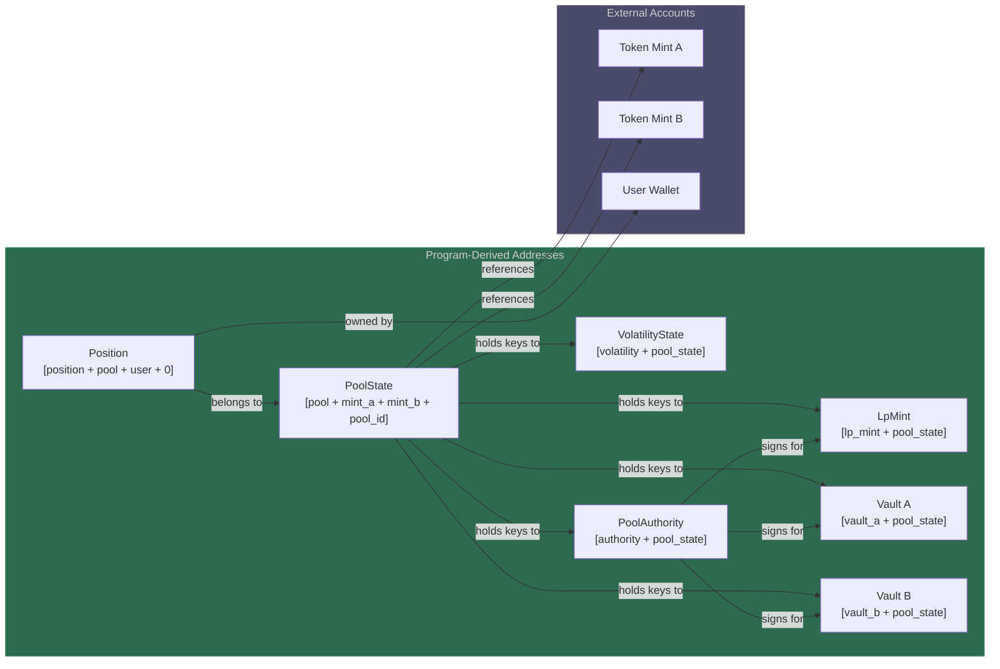
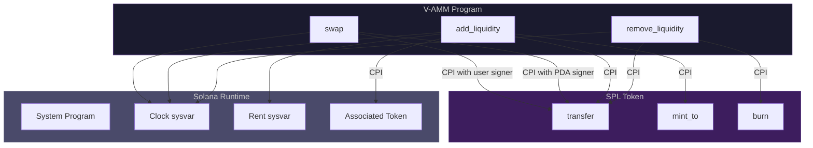
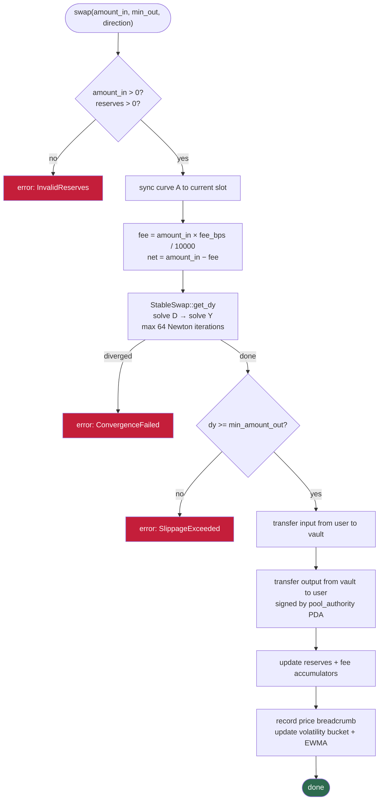
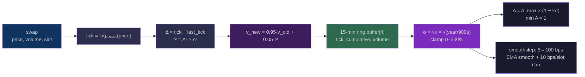
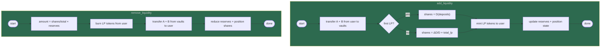

# V-AMM Architecture

> Solana Protocol Architecture — Capstone Assignment

---

## 1. Program Structure



The program is **one crate** — no cross-program calls between V-AMM modules. Everything lives in `programs/vamm/src/`. Instructions delegate to handler functions; math is a standalone module with zero dependencies.

## 2. Account Map & PDA Tree



Seven PDA types, all derived from `pool_state` or `pool_state + user`. The pool authority PDA signs CPI calls into the SPL Token program — no admin key, no multisig, no upgrade authority trick.

## 3. External Dependencies



All CPIs go to the SPL Token program or the system runtime. Two signer modes: user signs for deposits and input transfers; the pool authority PDA signs for vault withdrawals and LP minting.

## 4. Swap Flow



## 5. Volatility Pipeline



The entire pipeline runs on-chain in SBPF. No floating point — everything is u128 fixed-point with scale 1e12. The tick approximation uses `leading_zeros` for approximate log₂ then multiplies by the ln(1.0001) constant.

## 6. Add / Remove Liquidity



Liquidity uses the StableSwap D invariant: LP shares represent a proportional claim on the total D value of the pool, not a 1:1 mapping to token amounts. This is the same mechanism Curve uses — it handles imbalanced pools correctly under changing A.

## 7. Permissionless Cranks

The protocol has no admin. Two instructions can be called by anyone:

- **`update_volatility`** — reads the EWMA variance, annualizes it, recomputes target A and dynamic fee, sets a new ramp if A has shifted >10%
- **`update_curve`** — interpolates A between start and target over the ramp window (linear, 9000 slots)

Curve A ramps gradually. Fee changes are capped at 10 bps per slot. Both are designed so a keeper bot can call them once per block without disrupting the pool.

## 8. Error Handling

```
MathOverflow          — any checked_math failure
InvalidReserves       — zero reserves or zero input amount
SlippageExceeded      — output below user's minimum
ConvergenceFailed     — Newton-Raphson hit 64 iterations without converging
InvalidTokenAccount   — mint mismatch on user token accounts
Unauthorized          — position owner doesn't match signer
PoolPaused            — pool status flag set
VolatilityPaused      — volatility state flag set
ZeroAmount            — zero passed where positive required
InvalidAmplification  — A parameter out of valid range
InvalidFee            — fee parameter out of valid range
```

All paths through swap, add, and remove have explicit validation before any CPI. Errors bubble through `Result<()>` back to the runtime — no panics, no unwraps, no `assert!`.

## 9. Key Design Decisions

1. **Single program** — no fragmentation, one deploy, one audit surface
2. **PDA pool authority** — no admin key, programmatic signing only
3. **On-chain volatility** — no oracle dependency, works on any token pair
4. **Gradual A ramp** — prevents curve-transition arbitrage
5. **Rate-limited fees** — prevents fee manipulation attacks
6. **u128 fixed-point** — no floats, SBPF-compatible, battle-tested
7. **Permissionless cranks** — anyone can maintain the pool, no keeper key
8. **Pool ID** — multiple pools per token pair with different parameters
9. **Separate volatility account** — isolated state, independent writes
10. **Standard SPL Token** — full composability with Solana DeFi
