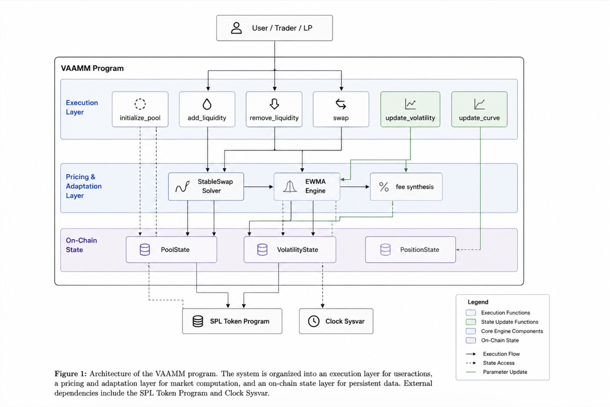

<p align="center">
  
  
  
  
</p>

<h1 align="center">V-AMM</h1>

<p align="center"><i>An AMM that breathes with the market.</i></p>

<p align="center">
A volatility-adaptive automated market maker on Solana. The curve shape and fee schedule respond to on-chain price action in real time — no oracles, no governance, no keeper keys.
</p>

<p align="center">
  <a href="#how-it-works">How it works</a> ·
  <a href="0x2vamm/">0→V-AMM</a> ·
  <a href="ARCHITECTURE.md">Architecture</a> ·
  <a href="reports/">Reports</a> ·
  <a href="#install">Install</a>
</p>

---

## How it works

Every swap leaves a price breadcrumb. An on-chain EWMA engine computes realized volatility from these breadcrumbs and drives two things:

- **Amplification A** — high when calm (flat curve, tight spread), low when volatile (steep curve, LP protection)
- **Dynamic fee** — smoothstep from 5 bps to 100 bps, EMA-smoothed, rate-limited to 10 bps per slot

A ramps over ~1 hour. Fees slide slowly — no jumps, no arb windows.

```
swap → tick ≈ log₁.₀₀₀₁(price) → Δtick² → EWMA(variance)
                               │
              ┌────────────────┘
              ▼
   σ = annualize(variance)
              │
     ┌────────┴────────┐
     ▼                  ▼
A = A_max(1 − kσ)   fee = smoothstep(σ)
     │                  │
     ▼                  ▼
ramp 9000 slots     EMA + 10 bps cap
```

<p align="center">
  
</p>

## A handler

```rust
pub fn swap(
    ctx: Context<Swap>,
    amount_in: u64,
    min_amount_out: u64,
    is_a_to_b: bool,
) -> Result<()> {
    let fee = (amount_in * pool.current_fee_bps) / 10000;
    let net_in = amount_in - fee;
    let dy = StableSwap::get_dy(&reserves, i, j, net_in, pool.curve_a_current)?;
    require!(dy >= min_amount_out, SlippageExceeded);

    // transfer in, transfer out, update reserves
    // write price breadcrumb for volatility engine
    update_volatility_bucket(vol_state, price, amount_in, clock.slot)?;
    Ok(())
}
```

Plain Anchor handlers. No custom dispatch, no derive wizardry.

[`0x2vamm/`](0x2vamm/) takes you from constant product to the full V-AMM in 8 short steps. [`ARCHITECTURE.md`](ARCHITECTURE.md) has the complete diagrams. [`reports/`](reports/) has deep dives on the math, volatility engine, and adversarial analysis.

## Architecture

```
vamm/
├── programs/vamm/src/
│   ├── lib.rs                     entry, 6 instructions
│   ├── state.rs                   PoolState, VolatilityState, PositionState
│   ├── math/mod.rs                StableSwap + volatility engine (496 loc)
│   ├── instructions/
│   │   ├── initialize_pool.rs     PDA init, cross-links
│   │   ├── swap.rs                trade + fee + volatility breadcrumb
│   │   ├── add_liquidity.rs       deposit, mint LP shares
│   │   ├── remove_liquidity.rs    burn LP, withdraw reserves
│   │   ├── update_volatility.rs   permissionless EWMA crank
│   │   └── update_curve.rs        permissionless A ramp sync
│   ├── error.rs                   11 error variants
│   └── constants.rs
└── Anchor.toml
```

## Instructions

| Instruction | Who | Does |
|---|---|---|
| `initialize_pool` | anyone (pays rent) | create pool + volatility PDAs, LP mint, token vaults |
| `swap` | trader | StableSwap trade with dynamic fee, writes volatility breadcrumb |
| `add_liquidity` | LP | deposit pair, receive LP shares proportional to D growth |
| `remove_liquidity` | LP | burn LP shares, withdraw proportional reserves |
| `update_volatility` | anyone | read EWMA, recompute A target + dynamic fee |
| `update_curve` | anyone | interpolate A between start and target |

## PDAs

| Account | Seeds |
|---|---|
| `PoolState` | `["pool", mint_a, mint_b, pool_id_le]` |
| `VolatilityState` | `["volatility", pool_state]` |
| `PoolAuthority` | `["authority", pool_state]` |
| `LpMint` | `["lp_mint", pool_state]` |
| `VaultA` / `VaultB` | `["vault_a" / "vault_b", pool_state]` |
| `Position` | `["position", pool, user, &[0]]` |

## Install

```bash
git clone git@github.com:srivtx/vamm-capstone.git
cd vamm-capstone/vamm
anchor build
anchor test
```

Requires Solana CLI, Anchor CLI, and Rust.

## Simulator (frontend)

A browser-based simulator lives at `vamm/app/`. It runs the same math as the on-chain program (1:1 canonical Curve StableSwap + EWMA volatility) in TypeScript so you can see the brain respond without deploying.

```bash
cd vamm-capstone/vamm/app
pnpm install
pnpm dev          # http://localhost:3000
```

Then open `http://localhost:3001/` for the landing page and `http://localhost:3001/simulate` for the interactive swap UI.

- `lib/stableswap.ts` — canonical Curve `get_D`, `get_y`, `get_Dy` (Newton-Raphson)
- `lib/ewma.ts` — `updateEwma`, `sigmaToA`, `computeFee`, `smoothstep`, `limitFeeChange`
- `lib/simulator.ts` — `PoolSimulator` with swap / crankVolatility / crankCurve / addLiquidity / history snapshots

The on-chain Rust math has 3 documented bugs vs canonical Curve (see `0x2vamm/03-stableswap.md` and the `__tests__/` investigations). The simulator uses the correct math so the demo works; do not copy the Rust math without the fixes.

## Status

Working end-to-end on devnet. Single program, six instructions, full StableSwap math with on-chain volatility engine. The A ramp works, fee synthesis is live. Research-grade — do not deploy to mainnet without an audit.

## License

MIT
